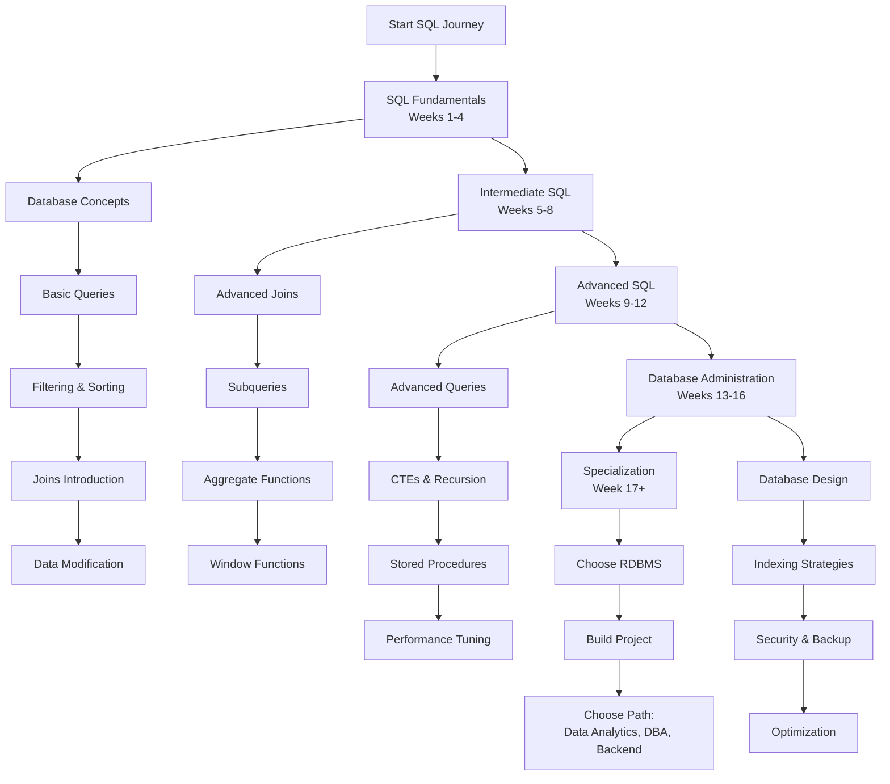

# SQL Developer Learning Path: A Structured Curriculum

This comprehensive roadmap provides a structured approach to mastering SQL development. The curriculum is designed sequentially, with each module building upon previous knowledge to ensure a solid foundation and progressive skill development.

---

## Phase 1: SQL Fundamentals (Weeks 1-4)

*   [**Module 1: Database Concepts & Setup**](https://github.com/example/sql-intro/#readme)
    *   Introduction to Databases: RDBMS vs NoSQL, Database Models
    *   SQL Standards and Dialects: PostgreSQL, MySQL, SQL Server, SQLite
    *   Installing Database Software (PostgreSQL/MySQL Recommended)
    *   Database Tools: pgAdmin, MySQL Workbench, DBeaver, VS Code Extensions
    *   Creating Your First Database and Understanding Database Structure

*   [**Module 2: Basic SQL Queries**](https://github.com/example/sql-basic-queries/#readme)
    *   `SELECT` Statement: Retrieving Data from Single Tables
    *   `FROM` Clause and Table References
    *   Selecting Specific Columns vs All Columns (`*`)
    *   Column Aliases with `AS` Keyword
    *   Basic `WHERE` Clause for Simple Filtering

*   [**Module 3: Filtering and Sorting Data**](https://github.com/example/sql-filtering-sorting/#readme)
    *   Comparison Operators: `=`, `!=`, `>`, `<`, `>=`, `<=`
    *   Logical Operators: `AND`, `OR`, `NOT`
    *   `BETWEEN` for Range Queries
    *   `IN` Operator for Multiple Values
    *   `LIKE` and `ILIKE` for Pattern Matching
    *   `ORDER BY` for Sorting Results (ASC/DESC)
    *   `LIMIT` and `OFFSET` for Pagination

*   [**Module 4: Working with Multiple Tables**](https://github.com/example/sql-joins-intro/#readme)
    *   Understanding Primary Keys and Foreign Keys
    *   `INNER JOIN` for Matching Records
    *   Table Aliases for Readability
    *   Joining Multiple Tables in Single Query
    *   Understanding Cartesian Products and Join Conditions

*   [**Module 5: Data Modification Operations**](https://github.com/example/sql-dml/#readme)
    *   `INSERT` Statement: Adding New Records
    *   `UPDATE` Statement: Modifying Existing Data
    *   `DELETE` Statement: Removing Records
    *   Transaction Control: `BEGIN`, `COMMIT`, `ROLLBACK`
    *   Understanding Data Integrity Constraints

---

## Phase 2: Intermediate SQL (Weeks 5-8)

*   [**Module 6: Advanced Joins and Set Operations**](https://github.com/example/sql-advanced-joins/#readme)
    *   `LEFT JOIN`, `RIGHT JOIN`, and `FULL OUTER JOIN`
    *   `CROSS JOIN` for Cartesian Products
    *   Self-Joins for Hierarchical Data
    *   Set Operations: `UNION`, `UNION ALL`, `INTERSECT`, `EXCEPT`
    *   Natural Joins and Using Clause

*   [**Module 7: Subqueries and Derived Tables**](https://github.com/example/sql-subqueries/#readme)
    *   Scalar Subqueries in SELECT and WHERE Clauses
    *   Correlated vs Non-Correlated Subqueries
    *   Subqueries with `IN`, `EXISTS`, `NOT EXISTS`
    *   Derived Tables (Subqueries in FROM Clause)
    *   Common Subquery Patterns and Best Practices

*   [**Module 8: Aggregate Functions and Grouping**](https://github.com/example/sql-aggregates/#readme)
    *   Aggregate Functions: `COUNT`, `SUM`, `AVG`, `MIN`, `MAX`
    *   `GROUP BY` Clause for Data Summarization
    *   `HAVING` Clause for Filtering Grouped Data
    *   Distinct vs Group By: When to Use Each
    *   Multiple Column Grouping and Rollup Operations

*   [**Module 9: Window Functions**](https://github.com/example/sql-window-functions/#readme)
    *   Introduction to Window Functions vs Aggregate Functions
    *   `OVER()` Clause and Partitioning with `PARTITION BY`
    *   Ranking Functions: `ROW_NUMBER()`, `RANK()`, `DENSE_RANK()`
    *   Analytical Functions: `LAG()`, `LEAD()`, `FIRST_VALUE()`, `LAST_VALUE()`
    *   Window Framing: `ROWS BETWEEN` and `RANGE BETWEEN`

---

## Phase 3: Advanced SQL Techniques (Weeks 9-12)

*   [**Module 10: Common Table Expressions (CTEs)**](https://github.com/example/sql-ctes/#readme)
    *   CTE Syntax with `WITH` Clause
    *   Multiple CTEs in Single Query
    *   Recursive CTEs for Hierarchical Data
    *   Organizational Charts and Tree Structures with Recursive CTEs
    *   CTEs vs Subqueries: Performance Considerations

*   [**Module 11: Data Definition Language (DDL)**](https://github.com/example/sql-ddl/#readme)
    *   `CREATE TABLE` with Data Types and Constraints
    *   Data Types: Numeric, Character, Date/Time, Boolean, JSON
    *   Constraints: `PRIMARY KEY`, `FOREIGN KEY`, `UNIQUE`, `CHECK`, `NOT NULL`
    *   `ALTER TABLE` for Schema Modifications
    *   `DROP TABLE` and `TRUNCATE TABLE` Operations

*   [**Module 12: Stored Procedures and Functions**](https://github.com/example/sql-programmability/#readme)
    *   Creating Stored Procedures with Parameters
    *   User-Defined Functions: Scalar and Table-Valued
    *   Control Flow: `IF/ELSE`, `CASE` Statements, Loops
    *   Error Handling with `TRY/CATCH` Blocks
    *   Cursors for Row-by-Row Processing

*   [**Module 13: Advanced Data Types and Operations**](https://github.com/example/sql-advanced-data-types/#readme)
    *   Working with JSON Data: Extraction and Modification
    *   Array Operations and Functions
    *   Full-Text Search Capabilities
    *   Spatial Data with GIS Functions
    *   Regular Expressions for Advanced Pattern Matching

---

## Phase 4: Database Design & Administration (Weeks 13-16)

*   [**Module 14: Database Design and Normalization**](https://github.com/example/sql-database-design/#readme)
    *   Entity-Relationship Diagrams (ERD) and Modeling
    *   Normal Forms: 1NF, 2NF, 3NF, BCNF
    *   Denormalization Strategies for Performance
    *   Index Design and Strategy
    *   Relationship Types: One-to-One, One-to-Many, Many-to-Many

*   [**Module 15: Indexing and Query Optimization**](https://github.com/example/sql-performance/#readme)
    *   How Indexes Work: B-Tree, Hash, GiST, SP-GiST
    *   Creating Effective Indexes: Single Column, Composite, Partial
    *   Query Execution Plans: `EXPLAIN` and `EXPLAIN ANALYZE`
    *   Identifying and Fixing Performance Bottlenecks
    *   Statistics and Query Optimization

*   [**Module 16: Database Security and Maintenance**](https://github.com/example/sql-security/#readme)
    *   User Management and Permissions
    *   Role-Based Access Control (RBAC)
    *   GRANT and REVOKE Statements
    *   Backup and Recovery Strategies
    *   Database Maintenance Tasks and Automation

*   [**Module 17: Transactions and Concurrency**](https://github.com/example/sql-transactions/#readme)
    *   ACID Properties: Atomicity, Consistency, Isolation, Durability
    *   Transaction Isolation Levels: Read Uncommitted, Read Committed, Repeatable Read, Serializable
    *   Locking Mechanisms and Deadlock Prevention
    *   MVCC (Multi-Version Concurrency Control)
    *   Handling Concurrent Data Access

---

## Phase 5: Specialization & Real-World Applications

*   [**Module 18: Advanced Analytics and Reporting**](https://github.com/example/sql-analytics/#readme)
    *   Time Series Analysis with Date/Time Functions
    *   Cohort Analysis and Customer Segmentation
    *   Running Totals and Moving Averages
    *   Statistical Functions and Percentile Calculations
    *   Pivoting Data with CASE and Crosstab Functions

*   [**Module 19: RDBMS-Specific Features**](https://github.com/example/sql-rdbms-specific/#readme)
    *   **PostgreSQL:** Advanced Data Types, Extensions, JSONB
    *   **MySQL:** Storage Engines, Replication, MySQL-Specific Functions
    *   **SQL Server:** T-SQL Features, CLR Integration, SSIS
    *   **Oracle:** PL/SQL, Advanced Analytics, Oracle-Specific Optimizations

*   [**Module 20: Capstone Project & Specialization**](https://github.com/example/sql-capstone/#readme)
    *   **Design and Build a Complete Database System**
    *   **Choose a Specialization Path:**
        *   **Database Administration (DBA):** Performance Tuning, High Availability, Disaster Recovery
        *   **Data Analytics:** Advanced Reporting, ETL Processes, Business Intelligence
        *   **Backend Development:** API Integration, ORM Understanding, Application Database Design
        *   **Data Engineering:** Data Warehousing, ETL Pipelines, Big Data Integration

---

## Additional Resources

*   [**SQL Style Guide**](https://github.com/example/sql-style-guide/#readme) - Coding Standards and Best Practices
*   [**SQL Interview Preparation**](https://github.com/example/sql-interview/#readme) - Common Interview Questions and Challenges
*   [**SQL Practice Platforms**](https://github.com/example/sql-practice/#readme) - Online Judges and Practice Databases
*   [**Database Documentation**](https://github.com/example/sql-documentation/#readme) - Official Documentation for Major RDBMS
*   [**SQL Community Resources**](https://github.com/example/sql-community/#readme) - Blogs, Forums, and Learning Platforms

**Note:** Each module includes hands-on exercises, real-world scenarios, and progressively challenging projects. The curriculum emphasizes practical application with sample databases like Northwind, AdventureWorks, or custom datasets. The timeline is flexible and can be adjusted based on individual learning pace.
